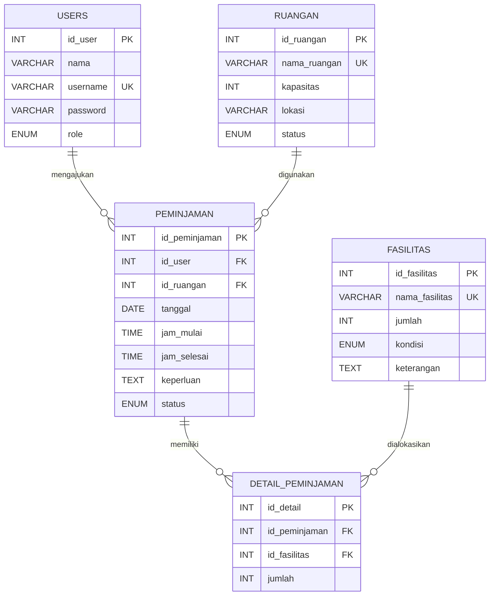

# Database dan ERD

Database utama menggunakan MySQL dengan lima tabel domain: `users`, `ruangan`, `fasilitas`, `peminjaman`, dan `detail_peminjaman`.

## ERD



Semua tabel domain memiliki `created_at` dan `updated_at`.

## Tabel domain

### users

| Kolom | Tipe | Aturan |
| --- | --- | --- |
| `id_user` | unsigned INT | Primary key, auto-increment |
| `nama` | VARCHAR(100) | Wajib |
| `username` | VARCHAR(50) | Wajib, unique |
| `password` | VARCHAR(255) | Hash, disembunyikan dari serialisasi |
| `role` | ENUM | `admin`, `petugas`, `peminjam`; default `peminjam` |
| `remember_token` | VARCHAR(100) | Nullable |

### ruangan

| Kolom | Tipe | Aturan |
| --- | --- | --- |
| `id_ruangan` | unsigned INT | Primary key, auto-increment |
| `nama_ruangan` | VARCHAR(100) | Wajib, unique |
| `kapasitas` | unsigned INT | Wajib |
| `lokasi` | VARCHAR(150) | Wajib |
| `status` | ENUM | `Tersedia`, `Digunakan`; default `Tersedia` |

Status ruangan adalah status operasional master. Pemakaian aktual tetap ditentukan oleh peminjaman berstatus `Disetujui`.

### fasilitas

| Kolom | Tipe | Aturan |
| --- | --- | --- |
| `id_fasilitas` | unsigned INT | Primary key, auto-increment |
| `nama_fasilitas` | VARCHAR(100) | Wajib, unique |
| `jumlah` | unsigned INT | Stok master |
| `kondisi` | ENUM | `Baik`, `Rusak`; default `Baik` |
| `keterangan` | TEXT | Nullable |

### peminjaman

| Kolom | Tipe | Aturan |
| --- | --- | --- |
| `id_peminjaman` | unsigned INT | Primary key, auto-increment |
| `id_user` | unsigned INT | Foreign key ke `users.id_user` |
| `id_ruangan` | unsigned INT | Foreign key ke `ruangan.id_ruangan` |
| `tanggal` | DATE | Tanggal peminjaman |
| `jam_mulai` | TIME | Awal interval |
| `jam_selesai` | TIME | Akhir interval |
| `keperluan` | TEXT | Wajib |
| `status` | ENUM | `Menunggu`, `Disetujui`, `Ditolak`, `Selesai` |

Index pencarian:

- `(id_ruangan, tanggal, jam_mulai, jam_selesai)` untuk konflik ruang.
- `(id_user, tanggal)` untuk riwayat peminjam.
- `(status, tanggal)` untuk antrean dan laporan.

### detail_peminjaman

| Kolom | Tipe | Aturan |
| --- | --- | --- |
| `id_detail` | unsigned INT | Primary key, auto-increment |
| `id_peminjaman` | unsigned INT | Foreign key ke peminjaman |
| `id_fasilitas` | unsigned INT | Foreign key ke fasilitas |
| `jumlah` | unsigned INT | Jumlah fasilitas pada pengajuan |

Kombinasi `(id_peminjaman, id_fasilitas)` unique agar satu fasilitas tidak muncul dua kali dalam pengajuan yang sama.

## Foreign key dan penghapusan

| Relasi | Aturan hapus |
| --- | --- |
| `peminjaman.id_user` → `users.id_user` | RESTRICT |
| `peminjaman.id_ruangan` → `ruangan.id_ruangan` | RESTRICT |
| `detail_peminjaman.id_peminjaman` → `peminjaman.id_peminjaman` | CASCADE |
| `detail_peminjaman.id_fasilitas` → `fasilitas.id_fasilitas` | RESTRICT |

## Tabel infrastruktur Laravel

- `sessions` untuk session database pada environment lokal.
- `password_reset_tokens` tersedia dari skeleton tetapi fitur reset password tidak digunakan.
- `cache` dan `cache_locks` untuk cache database.
- `jobs`, `job_batches`, dan `failed_jobs` untuk antrean Laravel.
- `migrations` mencatat migration yang sudah diterapkan.

## Migration

Migration historis tidak boleh diedit setelah diterapkan. Perubahan struktur berikutnya harus memakai migration maju baru.

Perintah aman untuk database aplikasi yang sudah ada:

```bash
php artisan migrate
```

`migrate:fresh` menghapus seluruh tabel dan hanya boleh digunakan pada database testing disposable, bukan database utama yang berisi data.
